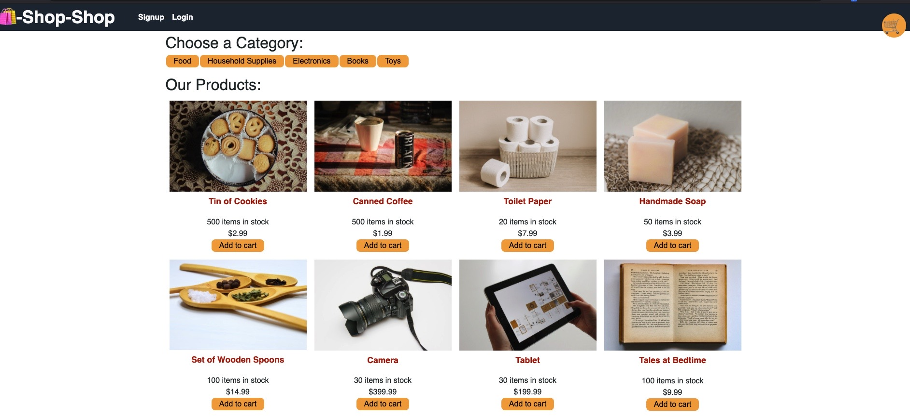

# 
**Book Search Engine**
   
  
  
## **DESCRIPTION**   
> A deployed React app that is an online shop.  
  
## **TABLE OF CONTENTS**  
* [DESCRIPTION](#DESCRIPTION)  
* [TABLE OF CONTENTS](#TABLE-OF-CONTENTS)  
* [APPLICATION LINKS](#APPLICATION-LINKS) 
* [INSTALLATION](#INSTALLATION)  
* [USAGE](#USAGE)  
* [LICENSE](#LICENSE)  
* [CONTRIBUTING](#CONTRIBUTING)  
* [TESTS](#TESTS)  
* [QUESTIONS](#QUESTIONS)  
  
## **APPLICATION LINKS**   
> [Live Application](https://calm-ravine-20811.herokuapp.com/)  
> [GitHub Repository](https://github.com/jeremyrice98/shop-shop2)  
  
## **INSTALLATION**   
No need to install, just proceed to the [deployed](ttps://calm-ravine-20811.herokuapp.com/) application.  
    
## **LICENSE**  
> This application is covered under the MIT license.
  
## **CONTRIBUTING**  
> 1. [Node.js](https://nodejs.org/en/)
> 2. [Node Package Manager](https://www.npmjs.com/)
>     - [compression](https://www.npmjs.com/package/compression)
>     - [dotenv](https://www.npmjs.com/package/dotenv)
>     - [Mongoose](https://mongoosejs.com/)
> 3. [Javascript](https://developer.mozilla.org/en-US/docs/Web/JavaScript)
> 4. [jQuery](https://jquery.com/)
> 5. [JSON](https://www.json.org/json-en.html)
> 6. [Heroku](www.heroku.com)
  
## **View of Deployed Application**  
1. In a browser, navigate to the [application](https://calm-ravine-20811.herokuapp.com/)

2. You will need to create and account prior to having the ability to post.
  
## **QUESTIONS**  
Please contact me for any inquiries!  
| Reach Out | Repositories | Profile |  
| :------: | :------: |  :------: |  
| <ricefamily1003@gmail.com> | [GitHub](https://github.com/jeremyrice98?tab=repositories) |  [LinkedIn](https://www.linkedin.com/in/jeremy-rice-99055113/) |   
